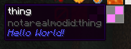
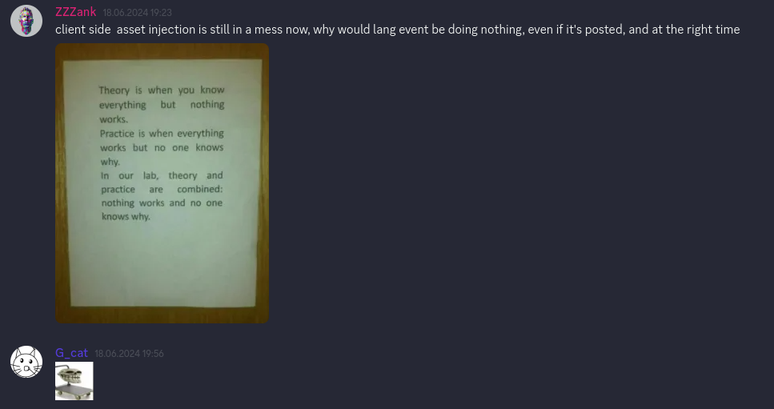

# KesseractJS
### Welcome to the 4th dimension.

[](https://www.curseforge.com/minecraft/mc-mods/kesseractjs)
[](https://github.com/hellish-mods/kesseractjs)

[](https://www.curseforge.com/minecraft/mc-mods/amber-jade)

**KesseractJS** is a fork of [KubeJS](https://kubejs.com/), continuing its development for 1.16.5. It backport a lot of different features from the newer versions, and even adds some that are not present at all in the original mod. The latter one is documented [on a dedicated wiki](https://wiki.modernmodpacks.site/wiki/hellish-mods/kesseractjs), and support for those are offered on [our discord server](https://discord.modernmodpacks.site), so don't be afraid to ask there.

This project was made as a collaboration between [Hellish Mods](https://github.com/Hellish-Mods), [ZZZank](https://github.com/zzzank), and [MundM2007](https://github.com/mundm2007), with the occasional help from [Team Potato](https://github.com/MCTeamPotato). Thank you guys <3

## Feature showcase

* Fake mod registration

```js
// In startup_scripts
Platform.registerFakeMod("notarealmodid").displayName("Hello World!")
onEvent('item.registry', event => {
	event.create('notarealmodid:thing')
})
```



* Backports

```js
// Welcome to the future babyyyy

// Falling block type
onEvent('block.registry', event => {
    event.create('metal_pipe').material('falling')
})
// Custom music discs (https://github.com/KubeJS-Mods/KubeJS/issues/491)
onEvent('item.registry', event => {
    event.create('disc_14').song('jamiroquai:vitrual_insanity')
})
// thickTexture/thinTexture and textureThick/textureThin intercompatibility
onEvent('fluid.registry', event => {
  event.create('you_dont_want_to_know')
    .thickTexture(0xFF0000)
    .textureThick(0xFF0000) // Both methods work!
})
// JsonIO
let data = JsonIO.read('kubejs/data.json')
JsonIO.write('kubejs/data.json', {recursion: data})

// + more!
```

* Fixes. Lot of 'em.



* Full drag-and-drop compatability with old Kube scripts

---

[](https://modernmodpacks.site)
